# Mappa dei componenti — Dem 1 → Dem 4

Le quattro demo della giornata sono **lo stesso programma**, con un pezzo in più ogni volta.
Il dominio (le notifiche) non cambia mai: cambia solo **come la notizia arriva al browser**.

Questa mappa risponde a tre domande:

- quali file esistono in ogni demo,
- chi chiama chi,
- **cosa cambia** rispetto alla demo precedente.

Le spiegazioni a parole sono in `DemN/spiegazione.md`, il flusso passo a passo in
`DemN/flusso.md`, i comandi per avviare e provare in `DemN/help.md`.

---

## 0. La progressione in una figura

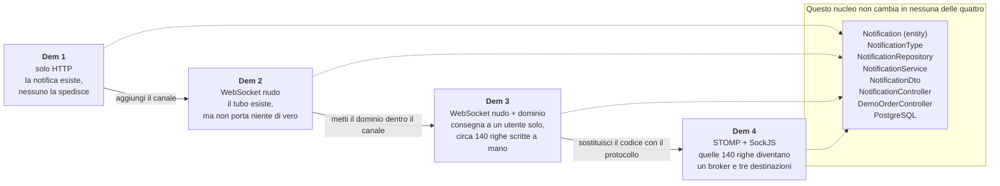

**I colori dei diagrammi**

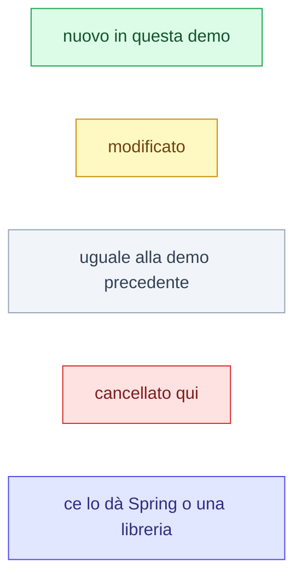

---

## 1. Dem 1 — solo HTTP

Il dato c'è, il canale no. Tutto quello che si vede in pagina arriva da due GET,
e parte sempre dal browser.

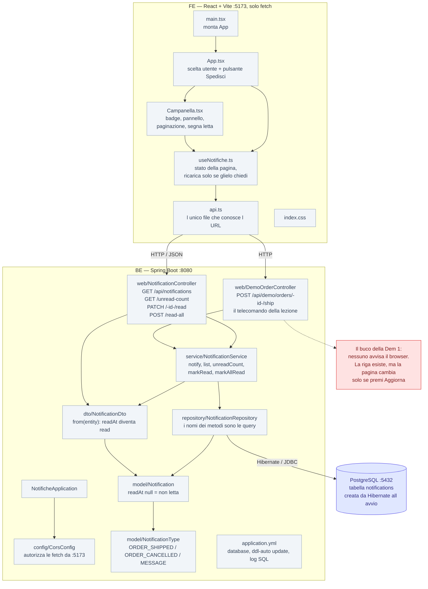

**Il percorso di una notifica**

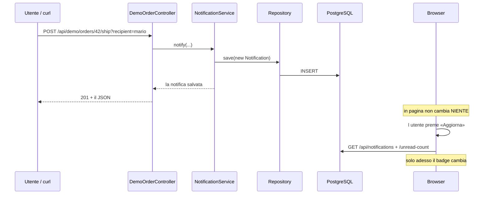

---

## 2. Dem 2 — il tubo, vuoto

Il database c'è ma non lo tocchiamo. Si costruisce solo il canale, e il canale è
**WebSocket nudo**: trasporta stringhe, e il significato glielo diamo noi.

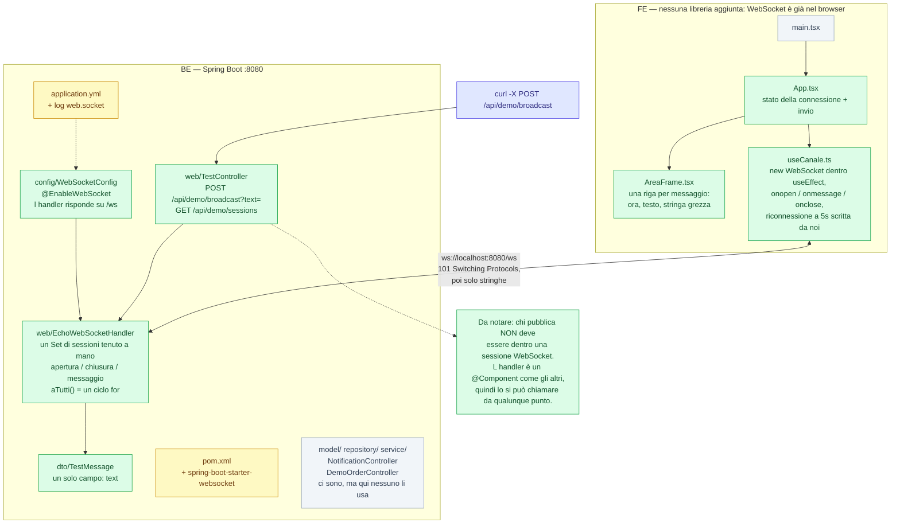

**Cosa manca ancora, e in quale demo arriva**

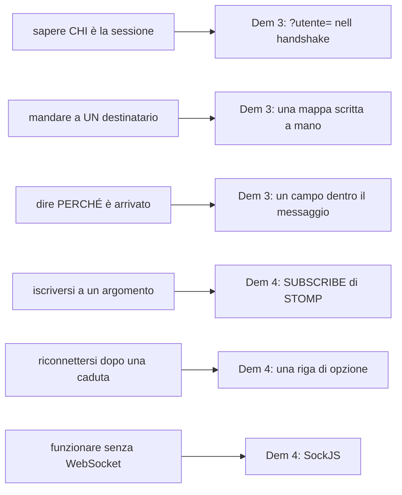

---

## 3. Dem 3 — il dominio dentro il tubo, tutto a mano

Le due metà si incontrano: la notifica della Dem 1 viaggia sul canale della Dem 2,
e arriva a **un utente solo**. Ma il canale è ancora nudo, quindi decidere
**a chi consegnare è codice nostro**.

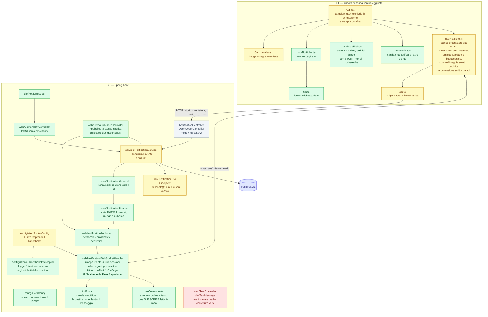

**Il registro tenuto a mano — il cuore della Dem 3**

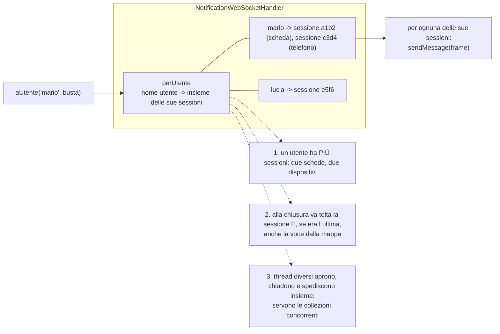

**Le tre destinazioni, e come sono fatte**

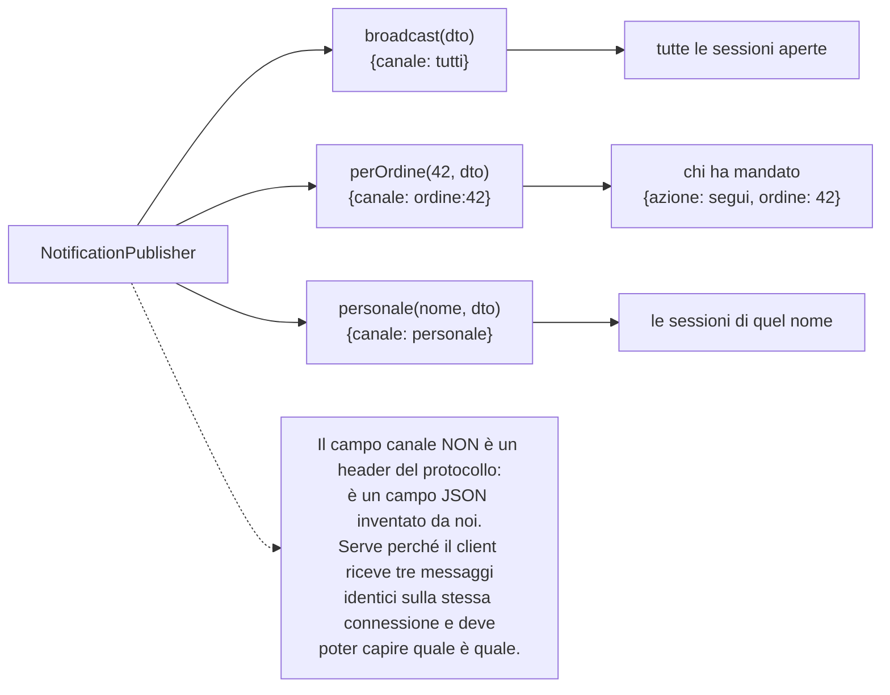

**Il percorso completo**

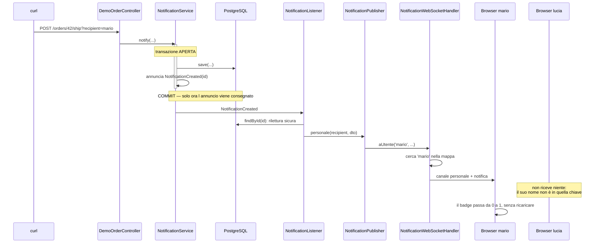

---

## 4. Dem 4 — STOMP sopra, SockJS sotto

Cambiano **due livelli**, e sono tutti e due sotto la nostra logica. Il pezzo in mezzo —
entity, service, evento dopo il commit, listener, storico REST — è la Dem 3 parola per parola.

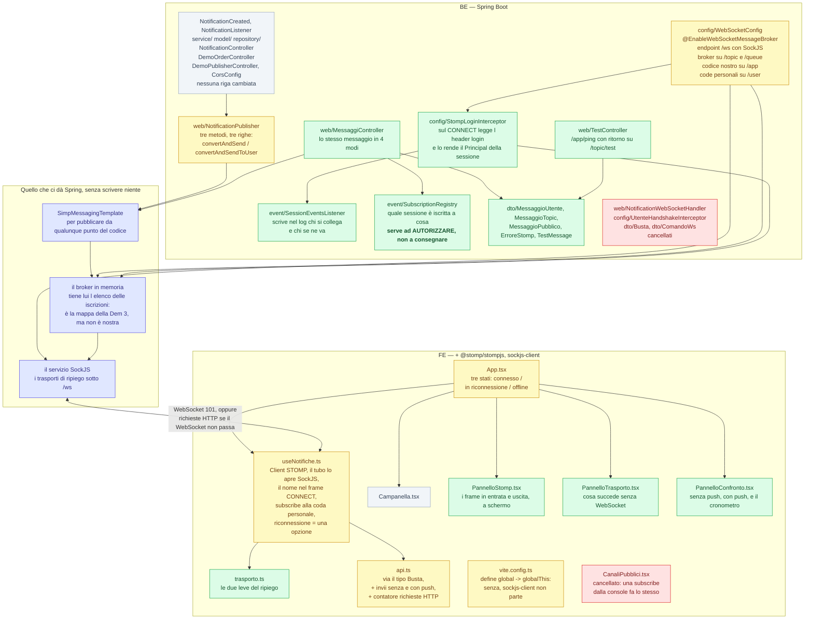

**Le tre famiglie di destinazioni — la cosa da non confondere**

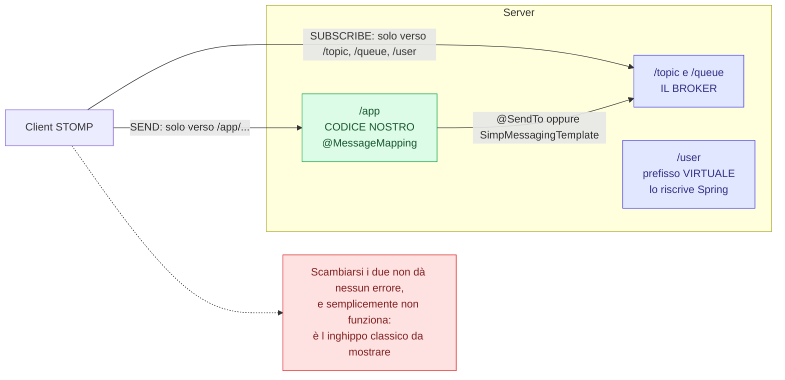

**Perché `/user` è privato davvero**

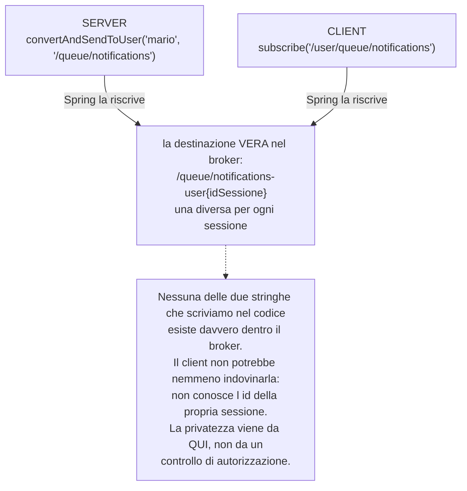

**L'apertura del canale, frame per frame**

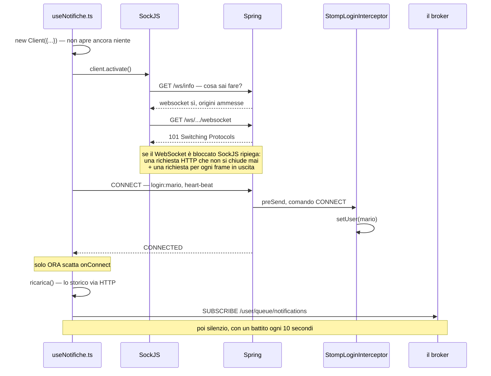

**Il percorso di una notifica (Dem 4)**

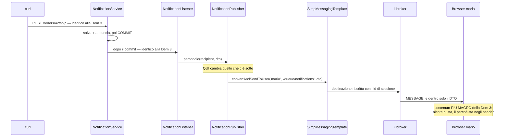

**Le quattro strade dello stesso messaggio**

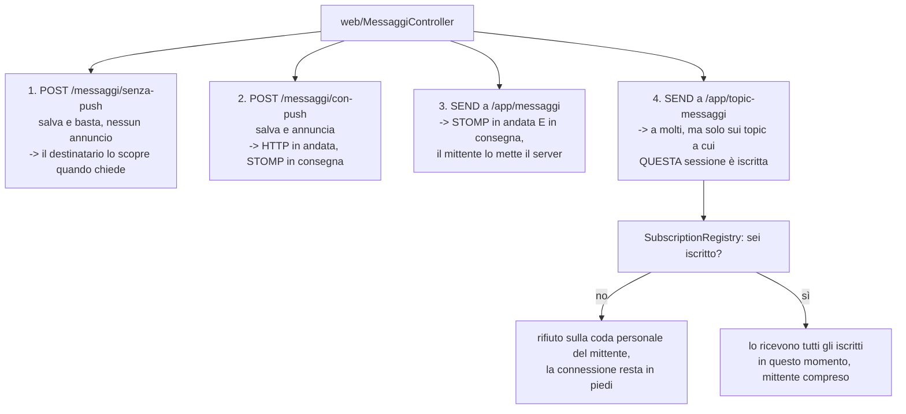

**I due trasporti, affiancati**

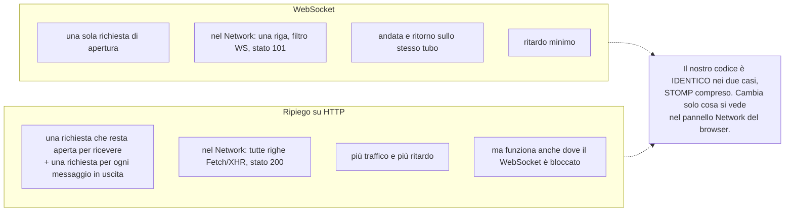

---

## 5. Il salto Dem 3 → Dem 4, in una figura

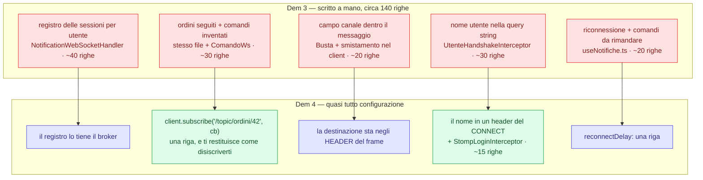

---

## 6. Cosa NON fa nessuna delle quattro

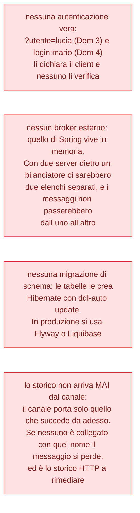
