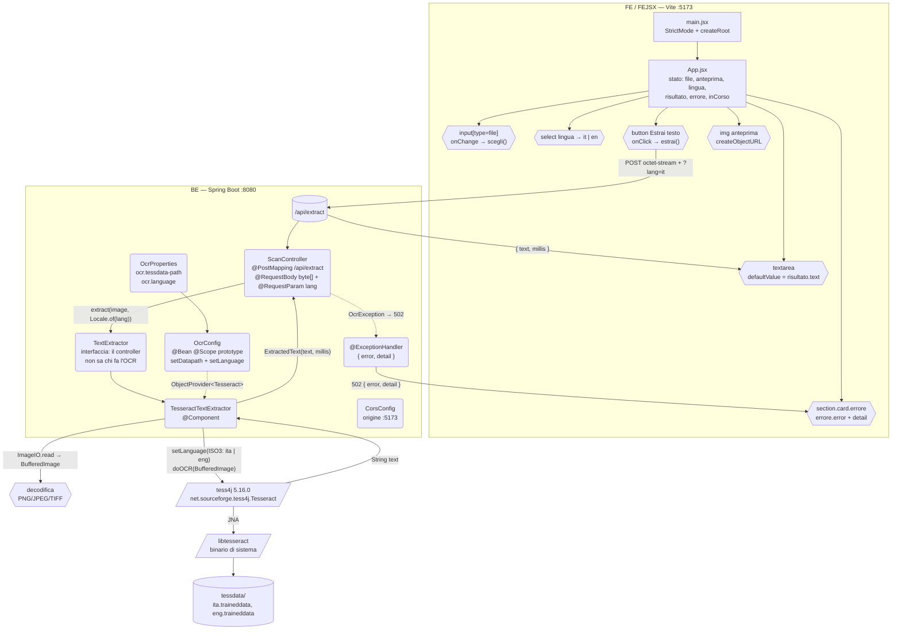
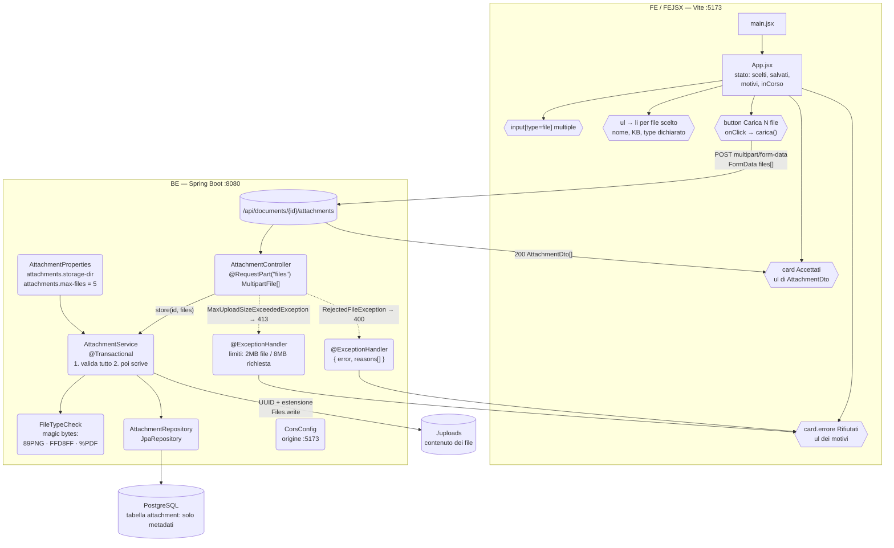
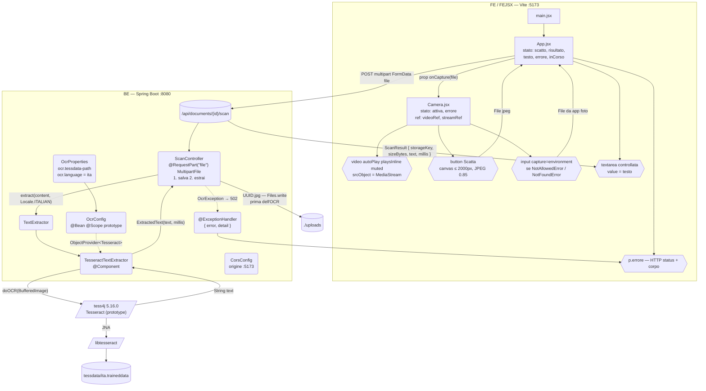
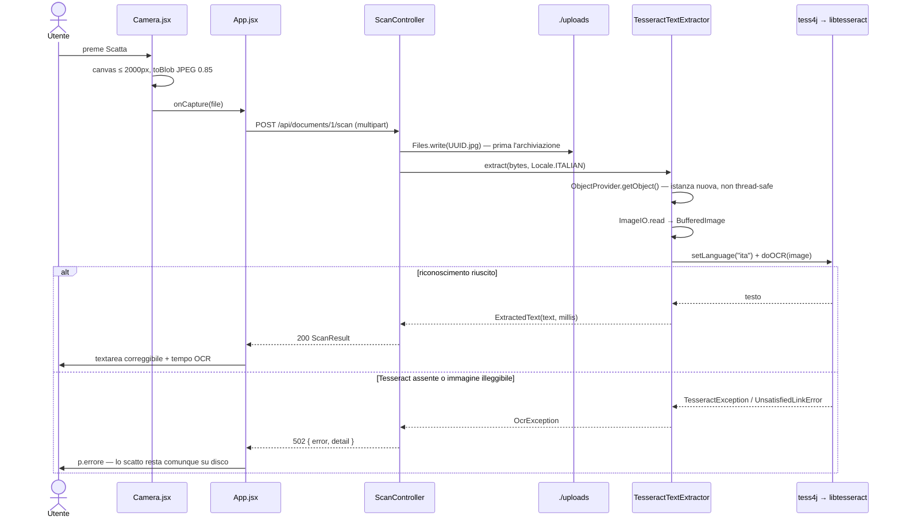

# Mappa dei componenti — Demo 01, 02, 03

Mappa completa: componenti React → endpoint → classi Spring → Tesseract.
Vale per entrambe le versioni del frontend, `FE` (TSX) e `FEJSX` (JSX): l'albero dei
componenti è identico, cambiano solo le estensioni dei file.

**Legenda**

| Forma | Significato |
|---|---|
| rettangolo | componente React |
| esagono `{{ }}` | elemento del DOM che porta l'interazione |
| cilindro `[( )]` | endpoint HTTP |
| rettangolo con bordi tondi, in `BE` | classe Spring (`@RestController`, `@Component`, `@Service`) |
| romboide | libreria/processo esterno al nostro codice (tess4j, libtesseract, `tessdata`) |
| cilindro doppio | archiviazione (filesystem, PostgreSQL) |

**Dov'è Tesseract**: solo in Dem01 e Dem03. Dem02 non fa OCR — è la demo degli allegati
(più file, tipo reale dai magic bytes, metadati su PostgreSQL). Per questo nella sua mappa
Tesseract non compare: non è una dimenticanza, è la differenza fra le due demo.

La catena OCR, uguale in Dem01 e Dem03:

```
TesseractTextExtractor (nostro codice, unica classe che nomina Tesseract)
  └─ tess4j 5.16.0            classe net.sourceforge.tess4j.Tesseract, bean @Scope("prototype")
       └─ JNA                 ponte Java → libreria nativa
            └─ libtesseract   binario installato sul sistema (Tesseract-OCR)
                 └─ tessdata  file .traineddata: ita.traineddata, eng.traineddata
```

Due punti che spiegano il codice:
- **prototype, non singleton**: un'istanza di `Tesseract` non è thread-safe, quindi
  `OcrConfig` la dichiara `@Scope(SCOPE_PROTOTYPE)` e l'estrattore ne chiede una nuova a ogni
  richiesta via `ObjectProvider<Tesseract>`.
- **niente eccezioni della libreria fuori dall'adattatore**: `TesseractException`,
  `UnsatisfiedLinkError` e `NoClassDefFoundError` (Tesseract non installato o `tessdata-path`
  sbagliato) diventano tutte `OcrException`, che il controller traduce in **502 Bad Gateway**.

---

## Dem01 — OCR di un'immagine

`App` è l'unico componente: tutto lo stato (`file`, `anteprima`, `lingua`, `risultato`,
`errore`, `inCorso`) vive lì. L'immagine viaggia come corpo grezzo della richiesta
(`application/octet-stream`), senza multipart: è un file solo.



---

## Dem02 — Allegati multipli (nessun OCR)

Qui non c'è Tesseract: la demo riguarda l'invio di **più file** e la loro conservazione.
Il tipo reale si legge dai primi byte, non da `Content-Type` dichiarato dal client; il
contenuto va sul filesystem, in PostgreSQL solo i metadati. Se un solo file è invalido
l'invio viene rifiutato **tutto**, prima di scrivere qualsiasi cosa.



---

## Dem03 — Dalla fotocamera al testo (scatto + salvataggio + OCR)

Le due demo precedenti si uniscono. Lato FE compare il primo componente figlio, `Camera`,
che isola `getUserMedia`, lo `stop()` dello stream nel cleanup e la riduzione del fotogramma
su canvas; comunica col padre con una sola prop, `onCapture(file)`.
Lato BE il controller **prima conserva** il file e **poi** chiama l'OCR: un errore di
Tesseract non deve far perdere lo scatto.



### Dem03 — la stessa cosa come sequenza



---

## Riassunto

| | Dem01 | Dem02 | Dem03 |
|---|---|---|---|
| Componenti React | `App` | `App` | `App`, `Camera` |
| Prop scambiate | — | — | `onCapture(file)` |
| Invio | corpo grezzo `octet-stream` | multipart, `files[]` | multipart, `file` |
| Endpoint | `POST /api/extract` | `POST /api/documents/{id}/attachments` | `POST /api/documents/{id}/scan` |
| Classi BE | `ScanController`, `TextExtractor`, `TesseractTextExtractor`, `OcrConfig`, `OcrProperties` | `AttachmentController`, `AttachmentService`, `FileTypeCheck`, `AttachmentRepository` | tutte quelle di Dem01 + salvataggio nel controller |
| Tesseract | **sì** (tess4j 5.16.0) | **no** | **sì** (tess4j 5.16.0) |
| Archiviazione | nessuna | `./uploads` + PostgreSQL (metadati) | `./uploads` |
| Errori tradotti | 502 `OcrException` | 400 rifiuto, 413 troppo grande | 502 `OcrException` |

**Configurazione Tesseract** (`application.yml`, Dem01 e Dem03):

```yaml
ocr:
  tessdata-path: ${TESSDATA_PATH:C:/Program Files/Tesseract-OCR/tessdata}
  language: ${OCR_LANGUAGE:ita}
```

Percorsi `tessdata` per sistema: Windows `C:/Program Files/Tesseract-OCR/tessdata` ·
Linux `/usr/share/tesseract-ocr/5/tessdata` · macOS `/opt/homebrew/share/tessdata`.
Se il percorso è sbagliato o Tesseract non è installato, il sintomo è sempre lo stesso:
502 con `detail` = "Tesseract non disponibile: …".
